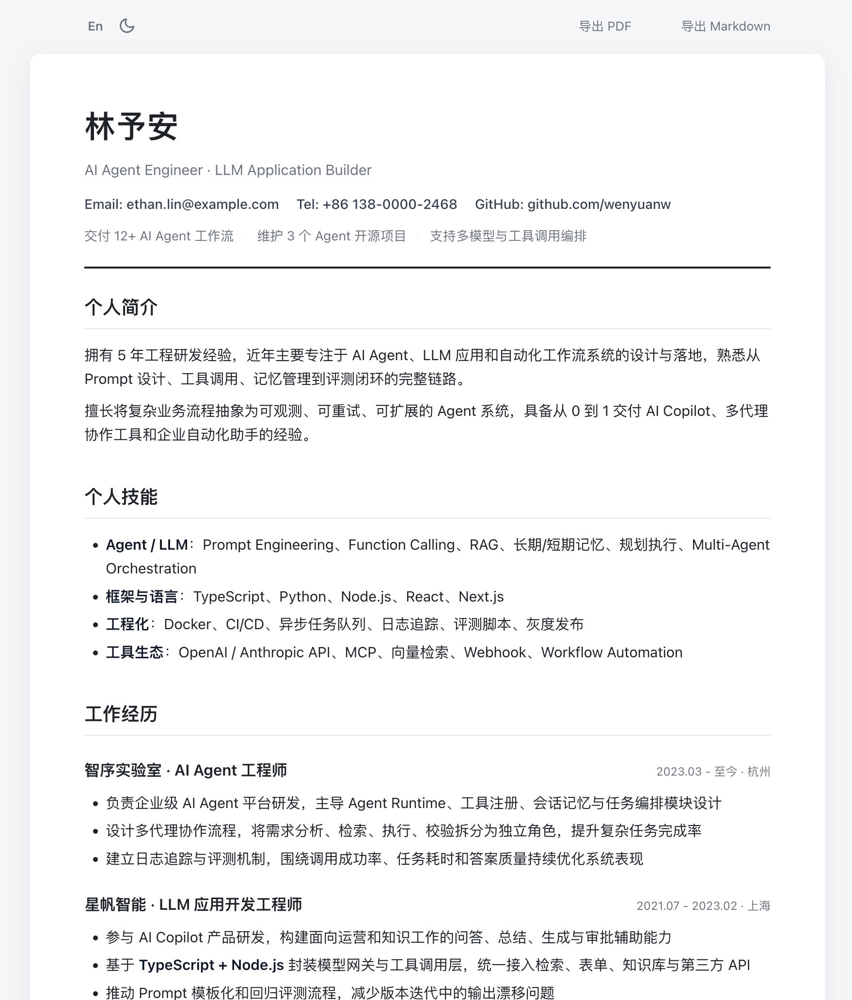

# CF Pages Resume Template

一个基于 Markdown 的开源静态简历模板，适合作为公开仓库、个人站点示例，或二次定制的起点。

[](https://dash.cloudflare.com/?to=/:account/workers-and-pages)
[](https://cf-pages-resume-template.pages.dev/)
[](./LICENSE)

## 页面预览



## 项目结构

```text
.
├── src/                      # 源文件（进仓库）
│   ├── resume.md
│   ├── resume.en.md
│   ├── index.template.html
│   ├── main.js
│   ├── style.css
│   ├── robots.txt
│   └── _headers
├── dist/                     # 构建产物（gitignore，部署此目录）
├── scripts/
│   ├── build.mjs
│   └── render-resume.mjs
├── package.json
├── wrangler.toml
└── .gitignore
```

## 特性

- Markdown 驱动，构建时预渲染为 HTML
- 内置中英文切换，主题切换
- 支持导出 PDF 和 Markdown
- 可直接部署到 Cloudflare Pages

## 快速开始

```bash
npm install
npm run dev
```

然后访问 `http://localhost:8080`。

## 如何自定义

1. 编辑 `src/resume.md` 自定义中文简历
2. 编辑 `src/resume.en.md` 自定义英文简历
3. 编辑 `src/style.css` 调整样式

`dist/` 由构建生成，不提交到仓库。本地预览或部署前执行 `npm run build`（`npm run dev` / `npm run deploy` 会自动执行）。

## 部署

### 一键进入 Cloudflare Pages

点击上方 `Deploy to Cloudflare Pages` 按钮，会打开 Cloudflare 的 `Workers & Pages` 控制台入口，你可以直接创建并连接这个仓库。

### Wrangler 直接部署

```bash
npm run login
npm run deploy
```

### GitHub 仓库连接部署

1. 进入 Cloudflare `Workers & Pages`
2. 选择你的 Pages 项目 → **Settings** → **Build**
3. 配置如下：

| 字段 | 值 |
|---|---|
| 构建命令 (Build command) | `npm run build` |
| 构建输出目录 (Build output directory) | `dist` |
| 根目录 (Root directory) | `/`（留空即可） |

4. 保存后重新触发部署

> **说明**：`wrangler.toml` 里的 `pages_build_output_dir` 只告诉 CF 输出目录是 `dist`，**不会**自动执行构建。`dist/` 在 gitignore 里，仓库中不存在，所以必须在控制台填写构建命令 `npm run build`，否则会出现 `Output directory "dist" not found`。

### 部署失败排查

若日志出现 `No build command specified. Skipping build step` 和 `Output directory "dist" not found`，说明构建步骤被跳过了——去控制台 **Settings → Build** 把构建命令改为 `npm run build` 即可。
